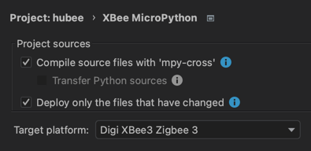

# Hubee: Hubitat + XBee  
  
**A framework to use DIY sensors/actuators on programmable XBee devices with Hubitat Elevation.**  
  
You can use one of the devices supported by this project or write your own.  
> If you want to contribute with code for new devices, or improvements to the existing codebase, you're welcome to create a Pull Request!  
> I'm not a microcontroller expert, I'm sure that there's a lot to be improved.  
  
## XBee Modules  
I've bought mine [here](https://www.sparkfun.com/products/15126) and at present following specs are shown in XCTU:  
  
- Product family: XB3-24  
- Function set: Digi XBee3 Zigbee 3.0 TH  
- Firmware version: 1014  
  
> This project might work with other programmable XBee models. I don't have any to test.  
> The firmware version has to be 1014 or newer.  
> Newer firmware may use newer MicroPython versions, which normally have improved performance and memory footprint.  

> If you have problems like ETIMEDOUT, ENODEV, inconsistent or unreal sensor readings. First check all of your wiring, but if there is no obvious reason, try connecting the negative of the 3.3V circuit to the ground line.  
  
I suggest that you read the first message [here](https://community.hubitat.com/t/everything-xbee/2328) which explains how to set the correct properties on your XBee Module to work with Hubitat.  
  
Make sure you have `AP` set to `MicroPython REPL [4]`  
  
> If you have several XBee modules, it will probably be better to create a configuration profile and then load it on every module.  

* The code itself will change `JV` and `JN` to `0` when it first runs, you don't need to do that.  
* You don't need to set `NI` (Human-friendly node identifier string) nor `BI` (Bluetooth Identifier), those will be set by the framework based on the name you gave to the Parent Device on Hubitat.  
* I strongly recommend to use a name starting with `'XB3 '` (without the quotes), and make it as short as possible, since on XBee the `NI` parameter is limited to 20 characters. Example: `XB3 Bedroom`  
  
> If you want to connect to your XBee using Bluetooth, you need to set a password in the `Bluetooth Authentication` section. I didn't find a way to set the password trough MicroPython code.  

To power the XBees I'm using **Hi-Link HLK-2M03** power modules.
  
## Development and Deployment  
  
### Install [PyCharm](https://www.jetbrains.com/pycharm/) and the [Digi XBee Plugin](https://plugins.jetbrains.com/plugin/12445-digi-xbee)  
  
> The Digi Plugin is not properly developed/maintained, therefore it [almost never](https://www.digi.com/support/forum/83401/pycharm-plugin-doesnt-work-with-pycharm-2022-2-2) works with the latest version of PyCharm. At present I'm working with PyCharm 2023.2.6 and Digi plugin 2.1.7 (which doesn't work on 2024.1).  
  
### Install [mpy-cross](https://pypi.org/project/mpy-cross/)  
mpy-cross is needed to cross compile the MicroPython code, otherwise the already very restricted RAM will most likely not be enough to run the project.  
  
**Before running any command for the project on a terminal, you must be in the project root folder and execute:**  
  
`source {YOUR_PROJECT_PATH}/hubee/venv/bin/activate`  
  
**Command to install mpy-cross:**  
  
`{YOUR_PROJECT_PATH}/hubee/venv/bin/pip install --upgrade mpy_cross==1.20`  
  
> Please note that the mpy-cross version should match the XBee MicroPython version. It is shown when you connect to the XBee using REPL. Eg: `MicroPython v1.20-1678-g32d849d`  
   
**Project settings**  
  
  
  
In the `Project Structure` section, set the following on the `Exclude files` field:  
`__init__.py;*DS_Store;drivers;hpm;test_*;sample*;*pycache*;*.md;*.png`  
  
### Deployment  
  
* Before loading any code on it, the first step is to pair the XBee module with Hubitat and set `Hubee Parent` in the `Type` field of the device  
* Important: Hit save in the preferences of the device  
* Load the code on the XBee via PyCharm  
* Let the code run, it will create the child devices  
* You might need to hit save on the preferences of the child devices too  
> see Hubitat Drivers and Libs below   
* Copy the `sample_main.py` to a `main.py` file.  
* Adjust the device creation according to what is being deployed.  
* If you are developing, change `IS_PROD` to `False` on `hubee.py`.  
  
  
If there is a memory allocation problem when running the code, you can exclude the files you don't need using the `Exclude files` option. Bytecode uses RAM even when not in use.  
  
### Hubitat Drivers and Libs  
  
They reside in the `drivers` folder and should be imported on the appropriate sections of the `Developer tools` in Hubitat before you run the code on an XBee.
* Make sure to disable the Zigbee Ping for the XBee devices (if your hub has this feature)  
  
## Supported sensors/actuators  
* XBee3 - Voltage, Temperature (of the board), Firmware, Free Memory, RSSI, Software.  
* Reed Switch (or any other open/close circuit device) - Contact sensor for doors, windows and etc.  
* BME680 - Temperature, Humidity, Air Quality, Pressure  
* TSL2591 - Illuminance  
* Hi-Link HLK-LD1125H-24G - Presence (mmWave Radar)  
* PIR Sensor - It can be independent or combined with a mmWave - Any sensor that outputs between 0.7 and 3.5Vcc (most do)  
* TOF10120 - As a proximity sensor